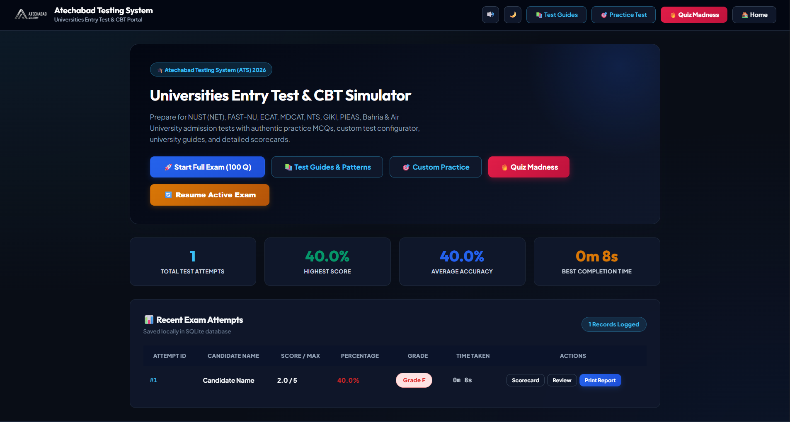
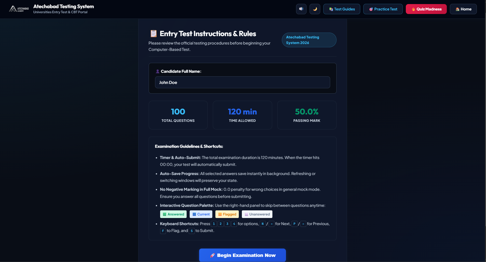

# 🎓 Entry Test Simulator for Bahria & Islamic University (IIUI)

Welcome to the **Entry Test Simulator**, a comprehensive Computer-Based Testing (CBT) preparation platform designed specifically for students aiming to secure admission into undergraduate programs at **Bahria University** and **International Islamic University Islamabad (IIUI)**.

This feature-rich application provides highly accurate testing simulations, detailed guides, and powerful analytics to help you conquer the admission tests.

**🌐 Try it Online Now:** [www.atechabad.com/ats/](https://www.atechabad.com/ats/)

---

## 📸 Platform Layout

Here is a glimpse of what the simulator looks like:

### Dashboard & Analytics


### Custom Practice & CBT Mode


---

## 🌟 Key Features

### 1. 🏛️ Dedicated University Guides
- Comprehensive details on test patterns, subject weightage, time breakdowns, and strategies.
- Fully up-to-date admission timelines, fee structures, and transfer policies for **Bahria University** and **International Islamic University Islamabad (IIUI)**.

### 2. 🎯 Custom Test Practices
Tailor your preparation to focus on your weak areas using our robust **Custom Practice Mode**:
- **Subject-Specific Filters**: Choose exactly which subjects you want to practice (e.g., only Mathematics and Physics).
- **Custom Question Counts**: Define how many questions you want to attempt per session.
- **Adjustable Time Limits**: Override the standard time limits to challenge your speed and accuracy.
- **Randomization Engine**: Questions and options are shuffled dynamically every time, ensuring a fresh test experience.

### 3. 🚀 Multiple Testing Modes
- **Full CBT Exam Simulator**: Experience the real deal with a 100-MCQ, 120-Minute test matching the official format of BUET and IIUI entry tests.
- **Quiz Madness Mode**: An exhaustive, unlimited testing mode covering the entire question bank across all subjects with **zero repeats**—perfect for final revision marathons.

### 4. 📊 Rich Analytics & Official Transcripts
- **Performance Visualizations**: Track your accuracy breakdowns, subject-wise section performance, and historical progression.
- **Detailed Question Review**: Step-by-step explanations for every question to help you learn from mistakes.
- **Official Printable Scorecards**: Generate and save printable transcripts (`/report/<id>`) of your mock attempts.

---

## 📂 Directory Structure

```text
/
├── app.py                  # Main Flask Application Controller (Routes, DB Engine, Logic)
├── questions/              # Question Banks (JSON format)
│   ├── english.json
│   ├── maths.json
│   ├── physics.json
│   ├── analytical.json
│   ├── gk.json
│   └── computer.json
├── static/
│   ├── css/                # Styling (Primary Light Theme, Glassmorphism, Dark Mode)
│   ├── js/                 # Client-side Logic (Timers, Randomizer, Chart.js)
│   └── img/                # Assets and Layout Previews
├── templates/              # HTML Templates (Jinja2)
│   ├── home.html           # Main Dashboard
│   ├── exam.html           # CBT Test Interface
│   ├── practice.html       # Custom Practice Configurator
│   └── ...                 # Additional layout files
└── database/
    └── scores.db           # SQLite Database Store for historical test records
```

---

## 🛠️ How to Run Locally

To start practicing right away on your own machine:

1. **Install Python**: Ensure you have Python 3.10 or higher installed.
2. **Install Dependencies**:
   ```bash
   pip install -r requirements.txt
   ```
3. **Run the Application**:
   ```bash
   python app.py
   ```
4. **Access the Portal**:
   Open your browser and navigate to `http://127.0.0.1:5000/`.

---

*Best of luck with your entry test preparation! Go ace those exams!* 🚀
